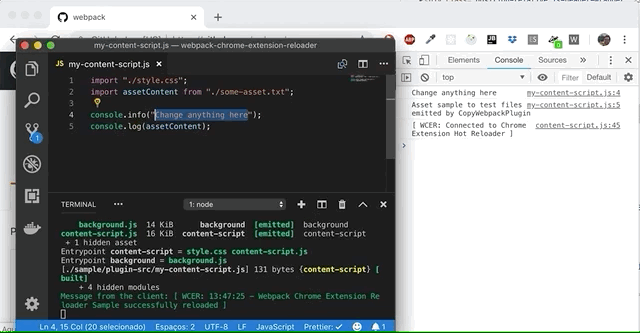

# Webpack Extension Reloader
A Webpack plugin to enable hot reloading while developing browser extensions.

# Disclaimer
Targeting to support all browsers, it uses the `webextension-polyfill` package which follows the [Standard WebExtension API](https://developer.mozilla.org/en-US/docs/Mozilla/Add-ons/WebExtensions),
which is based on [Promises](https://developer.mozilla.org/en-US/docs/Web/JavaScript/Reference/Global_Objects/Promise). If you're developing on Chrome (which bases the API on callbacks), it may throw
exceptions. It's **highly recommended** to use this polyfill for your extensions production builds too.

<div align="center">
  <a href="https://github.com/webpack/webpack">
    
  </a>
  <br>
  <br>
</div>
  
[](https://badge.fury.io/js/webpack-extension-reloader)
[](https://travis-ci.org/rubenspgcavalcante/webpack-extension-reloader)
[](https://www.npmjs.com/package/webpack-extension-reloader)
[](https://www.codacy.com/app/rubenspgcavalcante/webpack-extension-reloader?utm_source=github.com&amp;utm_medium=referral&amp;utm_content=rubenspgcavalcante/webpack-extension-reloader&amp;utm_campaign=Badge_Grade)

## Installing

npm
```
npm install webpack-extension-reloader --save-dev
```

yarn 
```
yarn add webpack-extension-reloader --dev
```

## Solution for ...
Have your ever being annoyed while developing a browser extension, and being unable to use
webpack-hot-server because it's not a web app but a browser extension?

Well, now you can do hot reloading!



## What it does?
Basically something similar to what the webpack hot reload middleware does. When you change the code and the webpack
trigger and finish the compilation, your extension is notified and then reloaded using the [standard browser runtime API](https://developer.mozilla.org/en-US/docs/Mozilla/Add-ons/WebExtensions).  
Check out [Hot reloading extensions using Webpack](https://medium.com/front-end-hacking/hot-reloading-extensions-using-webpack-cdfa0e4d5a08) for more background.

## How to use
### Using as a plugin
Add `webpack-extension-reloader` to the plugins section of your webpack configuration file.
```js
const ExtensionReloader  = require('webpack-extension-reloader');

plugins: [
    new ExtensionReloader()
]
```

You can also set some options (the following are the default ones):
```js
// webpack.dev.js
module.exports = {
  mode: "development", // The plugin is activated only if mode is set to development
  watch: true,
  entry: {
      'content-script': './my-content-script.js',
      background: './my-background-script.js'
  },
  //...
  plugins: [
      new ExtensionReloader({
        port: 9090, // Which port use to create the server
        reloadPage: true, // Force the reload of the page also
        entries: { // The entries used for the content/background scripts
          contentScript: 'content-script', // Use the entry names, not the file name or the path
          background: 'background' // *REQUIRED
        }
      })
  ]
}
```

And then just run your application with Webpack in watch mode:
```bash
NODE_ENV=development webpack --config myconfig.js --mode=development --watch 
```

**Important**: You need to set `--mode=development` to activate the plugin (only if you didn't set on the webpack.config.js already) then you need to run with `--watch`, as the plugin will be able to sign the extension only if webpack triggers the rebuild (again, only if you didn't set on webpack.config).

### Multiple Content Script support
If you use more than one content script in your extension, like:
```js
entry: {
    'my-first-content-script': './my-first-content-script.js',
    'my-second-content-script': './my-second-content-script.js',
    // and so on ...
    background: './my-background-script.js'
}
```

You can use the `entries.contentScript` options as an array:
```js
plugins: [
    new ExtensionReloader({
      entries: { 
        contentScript: ['my-first-content-script', 'my-second-content-script', /* and so on ... */],
        background: 'background'
      }
    })
]
```

### CLI
If you don't want all the plugin setup, you can just use the client that comes with the package.  
You can use by installing the package globally, or directly using `npx`:

```bash
npx webpack-extension-reloader
```
If you run directly, it will use the  default configurations, but if you want to customize
you can call it with the following options:
```bash
npx webpack-extension-reloader --config wb.config.js --port 9080 --no-page-reload --content-script my-content.js --background bg.js 
```
If you have **multiple** content scripts, just use comma (with no spaces) while passing the option
```bash
npx webpack-extension-reloader --content-script my-first-content.js,my-second-content.js,my-third-content.js 
```

### Client options

| name             | default           | description                                                       |
| ---------------- | ----------------- | ----------------------------------------------------------------- |
| --help           |                   | Shows this help                                                   |
| --config         | webpack.config.js | The webpack configuration file path                               |
| --port           | 9090              | The port to run the server                                        |
| --content-script | content-script    | The **entry/entries** name(s) for the content script(s)           |
| --background     | background        | The **entry** name for the background script                      |
| --no-page-reload |                   | Disable the auto reloading of all **pages** which runs the plugin |

Every time webpack triggers a compilation, the extension reloader are going to do the hot reload :)  
**Note:** the plugin only works on **development** mode, so don't forget to set the NODE_ENV before run the command above

### Contributing
Please before opening any **issue** or **pull request** check the [contribution guide](/.github/CONTRIBUTING.MD).

### Building and Testing
Inside this repository have an example plugin, so you can test and see it working
After cloning the repository, run:  
```
yarn build
```

 And then run:  
 ```
 yarn start:sample
 ```
 
 This will make the webpack run in watch mode for the sample plugin source and output the built files on the "dist"
 directory.
 Load the extension **(the files in "sample/dist" directory)** using the "load unpacked extension", open a 
 new tab in any site and open the developer panel on it. Watch the dev. tools console tab, and do some changes on 
 the background or content script. Voila!

**Note:**
You must have both background and content scripts for this plugin to work, and they must be specified in separate `entry` chunks
in your webpack config.

The reloading script will be injected only on the main entries chunks (in background and content script). Any other
chunks will be ignored.

### License
This project is under the [MIT LICENSE](http://opensource.org/licenses/MIT)
